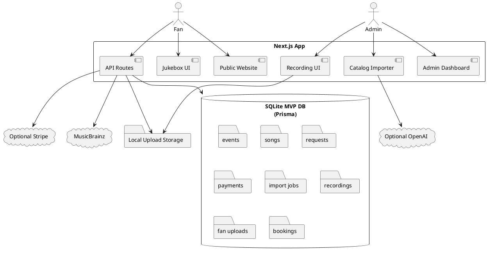
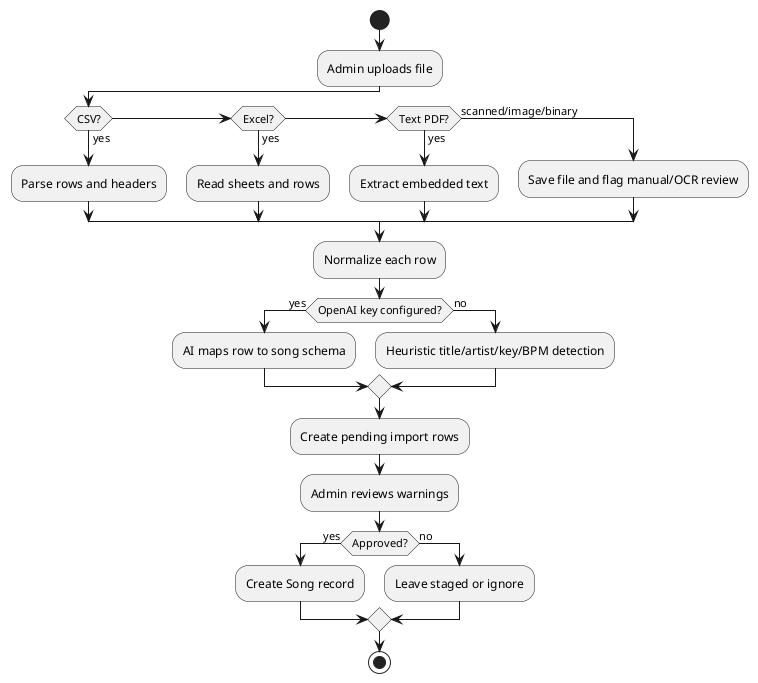
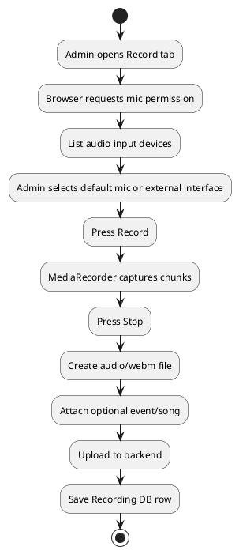
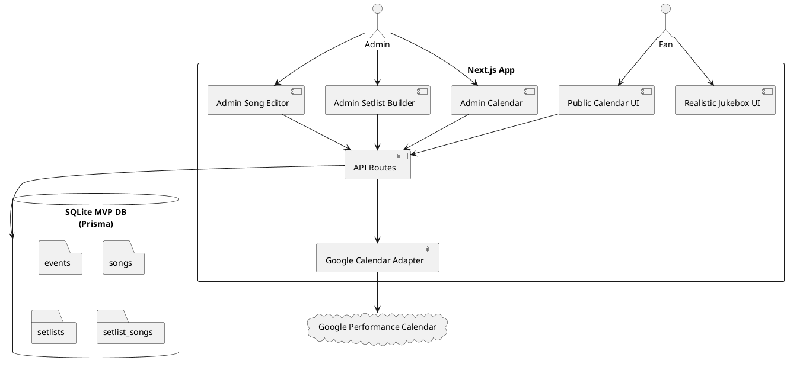
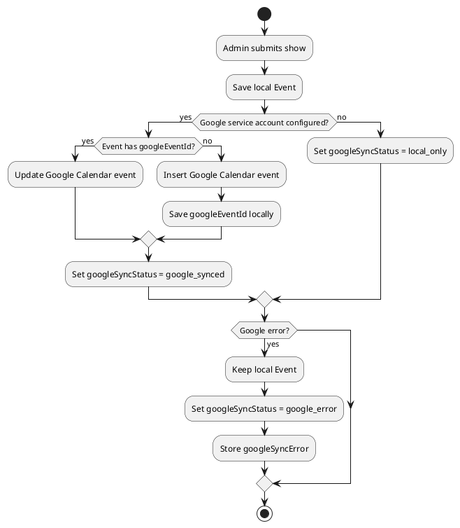
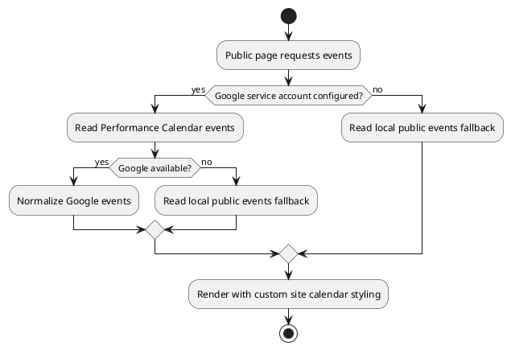
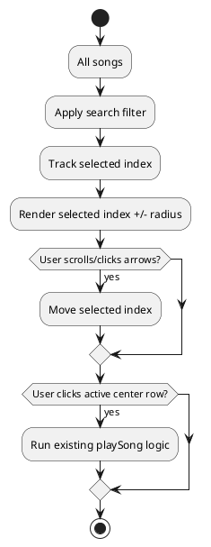

# SPEC-1-GeorgeGrissomLiveFanWebApp

## Background

George Grissom's site is being rebuilt from a static performer website into a real MVP web app. The MVP combines a public music site, audience request/tip flow, private performer dashboard, manual show calendar, song catalog import system, private lyrics/chords/rehearsal notes, fan media uploads, a jukebox concept, and one-button recording.

The uploaded prototype ZIP is preserved under `legacy/` and used as the visual/product seed. This package replaces the static-only prototype with a runnable full-stack app.

## Requirements

### Must Have

- Public website with performer branding, jukebox, calendar, request form, promote flow, uploads, and booking form.
- Real MVP web app with backend APIs and database.
- Admin dashboard protected by login.
- Manual calendar entry in admin.
- Calendar public display as upcoming date list.
- Venue name click/search behavior on public calendar.
- Song catalog import from CSV, Excel, text PDF, text files, and staged scanned/binary files.
- AI-compatible song normalization when OpenAI key is configured.
- Private artist-only lyrics/chords/rehearsal notes.
- Search-and-save workflow so the artist can find song metadata and private learning links.
- Audience song requests with tip amount and priority queue.
- Audience cannot see private live setlist or private song notes.
- Jukebox with two free plays per song before credit/unlock prompt.
- Popup closes on outside click and "maybe later."
- One-button recording from built-in microphone or external mixer/audio interface.
- Fan uploads stored for admin moderation.
- Optional Stripe checkout for tips, catalog unlock, and jukebox credits.
- Demo/manual mode when Stripe is not configured.

### Should Have

- Mobile-friendly public site.
- Tablet-friendly admin dashboard.
- Dark dive-bar jukebox styling and light winery/daytime styling.
- Import staging screen with warnings and approve button.
- Music metadata search via MusicBrainz.
- External web search links for lyrics/chords/key/BPM research.
- Booking inquiry management.

### Could Have Later

- Supabase/Postgres production backend.
- Supabase Realtime, Pusher, Ably, or WebSockets for instant queue updates.
- Cloud object storage.
- Full OCR pipeline for scanned PDFs/images.
- Licensed lyric API integration.
- QR codes per show.
- AI-generated show recaps.
- Public approved media gallery/download page.
- More realistic illustrated scene transitions.

### Won't Have in This MVP

- Native mobile apps.
- Public publishing or sale of private lyrics/chords.
- Automated copyright/licensing decisions.
- Fully automated scanned PDF OCR without additional production service.
- Direct GitHub/Google Drive backup from inside ChatGPT.

## Method

### Architecture



### MVP Technology Choices

- Next.js App Router for web pages and backend route handlers.
- Prisma for database access.
- SQLite for immediate local execution.
- Stripe Checkout as optional payment processor.
- OpenAI structured normalization as optional AI enrichment.
- MusicBrainz API for metadata search.
- Browser `MediaDevices` and `MediaRecorder` APIs for recording.
- Local filesystem uploads for MVP.

### Private Lyrics/Chords Rule

Lyrics, chords, copied reference notes, and rehearsal material are private admin-only records by default. They are stored in:

- `privateLyricsNotes`
- `privateChordNotes`
- `privateRehearsalNotes`

The public site does not render those fields.

### Song Import Algorithm



### Recording Algorithm



## Data Model

The canonical schema is in `prisma/schema.prisma`.

Core entities:

- `Event`
- `Song`
- `Request`
- `Payment`
- `ImportJob`
- `ImportRow`
- `Recording`
- `FanUpload`
- `BookingInquiry`

## Implementation

1. Install dependencies.
2. Configure `.env`.
3. Initialize Prisma database.
4. Seed starter event and songs.
5. Run local dev app.
6. Log into admin.
7. Add real events manually.
8. Add/import real songs.
9. Test public requests and admin queue.
10. Test one-button recording.
11. Configure Stripe for payment testing.
12. Configure OpenAI for smarter imports.

## Milestones

### Milestone 1 — Local MVP Runs

- Site opens.
- Admin login works.
- Database seeded.
- Manual events and songs work.

### Milestone 2 — Live Show Workflow

- Audience submits request.
- Admin sees priority queue.
- Admin marks request accepted/played/skipped.
- Jukebox free-play/credit prompt works.

### Milestone 3 — Catalog Workflow

- CSV/Excel import works.
- Text PDF import works.
- AI normalization works when key configured.
- Admin review/approval works.
- Private notes stay admin-only.

### Milestone 4 — Recording and Media

- Device selection works.
- Built-in mic recording works.
- External mixer/interface input works when browser exposes it.
- Recording saves privately.
- Fan uploads save and can be moderated.

### Milestone 5 — Production Hardening

- Move database to Postgres.
- Move uploads to object storage.
- Replace simple admin password with production auth.
- Add realtime queue updates.
- Configure real Stripe webhooks.
- Add OCR and/or licensed lyrics providers.

## Gathering Results

Evaluate MVP success by checking:

- Can George add events without a developer?
- Can George import messy song lists and approve normalized songs?
- Can private lyrics/chords/notes be stored without public exposure?
- Can a fan request a song and tip?
- Does tip amount change dashboard priority?
- Does the jukebox block after free plays and offer credits?
- Can George record from mic and mixer/interface input?
- Can fan uploads be moderated?
- Can a contractor deploy and extend the app from this package?

## Need Professional Help in Developing Your Architecture?

Please contact me at [sammuti.com](https://sammuti.com) :)


---

# SPEC-2-JukeboxSetlistsAndGooglePerformanceCalendarAddendum

## Background

The MVP was extended to support three requested upgrades: a more realistic inward-turned jukebox, private admin setlists, and Google Performance Calendar interoperability while preserving the site's custom public calendar styling.

## Requirements

### Must Have

- Realistic jukebox visual treatment inspired by the uploaded chrome/glass jukebox reference.
- Jukebox angled inward by 30 degrees.
- Public jukebox song browsing as a performant scroll-wheel selector.
- Admin-only/private setlists for MVP.
- Create setlists from scratch.
- Duplicate older setlists.
- Associate setlists with a venue, date created, optional notes, and optional show/calendar event.
- Freely associate songs and setlists through a many-to-many relationship.
- Add songs to a setlist from the setlist builder by searching songs and checking boxes.
- Associate a song with setlists from the song editor by typing setlist names.
- Create/update Google Calendar events when an admin adds or edits a show.
- Public calendar reads event data from the Google Performance Calendar but keeps custom app styling.
- Store `googleEventId` locally to avoid duplicate Google events.

### Should Have

- Show Google sync status in admin.
- Fall back to local public events if Google Calendar is unavailable or not configured.
- Let admin reorder setlist songs.
- Keep the public scroll-wheel lightweight by rendering only visible rows.

### Could Have Later

- Full two-way sync for events created directly in Google Calendar.
- Recurring-event editing inside the admin UI.
- Publicly publish selected setlists after a show.
- Drag-and-drop setlist ordering with a dedicated DnD library.

### Won't Have in This MVP

- Public setlist display.
- Public access to private notes, lyrics, or chords.
- Embedded Google Calendar visual styling.
- Full Google conflict resolution.

## Method

### Architecture



### Data Model

New and changed entities are implemented in `prisma/schema.prisma`.

```prisma
model Event {
  id                 String    @id @default(cuid())
  title              String
  startsAt           DateTime
  endsAt             DateTime?
  venueName          String
  city               String?
  state              String?
  notes              String?
  isPublic           Boolean   @default(true)
  googleCalendarId   String?
  googleEventId      String?   @unique
  googleSyncStatus   String    @default("local_only")
  googleLastSyncedAt DateTime?
  googleSyncError    String?
  setlists           Setlist[]
}

model Setlist {
  id        String        @id @default(cuid())
  name      String
  venueName String
  eventId   String?
  notes     String?
  isPrivate Boolean       @default(true)
  createdAt DateTime      @default(now())
  updatedAt DateTime      @updatedAt
  event     Event?        @relation(fields: [eventId], references: [id], onDelete: SetNull)
  songs     SetlistSong[]
}

model SetlistSong {
  id        String   @id @default(cuid())
  setlistId String
  songId    String
  position  Int      @default(0)
  notes     String?
  setlist   Setlist  @relation(fields: [setlistId], references: [id], onDelete: Cascade)
  song      Song     @relation(fields: [songId], references: [id], onDelete: Cascade)

  @@unique([setlistId, songId])
}
```

### API Routes

```txt
GET    /api/events
GET    /api/events?admin=1
POST   /api/events
PATCH  /api/events
DELETE /api/events?id=

GET    /api/setlists?admin=1
POST   /api/setlists
PATCH  /api/setlists
DELETE /api/setlists?id=

POST   /api/setlists/duplicate
POST   /api/setlists/songs
PATCH  /api/setlists/songs
DELETE /api/setlists/songs?setlistId=&songId=
PATCH  /api/setlists/songs/reorder
```

### Google Calendar Sync

Google integration lives in:

```txt
src/lib/google-calendar.ts
src/lib/public-events.ts
```

Calendar ID:

```txt
0d93f3b5191f80e930ce0cdb7249a796230adbd8ba2049e7e4e323ffc632cf68@group.calendar.google.com
```

Environment variables:

```env
GOOGLE_CALENDAR_ID="0d93f3b5191f80e930ce0cdb7249a796230adbd8ba2049e7e4e323ffc632cf68@group.calendar.google.com"
GOOGLE_SERVICE_ACCOUNT_EMAIL=""
GOOGLE_SERVICE_ACCOUNT_PRIVATE_KEY=""
```

Sync algorithm:



Public calendar algorithm:



### Jukebox Method

The jukebox remains CSS/React instead of WebGL for performance and maintainability.

```txt
CSS realistic jukebox
+ rotateY(-30deg)
+ fixed/sticky public stage
+ virtualized scroll-wheel selector
+ search filter
+ existing play/free-credit logic
```

Only the visible wheel window is rendered around the selected song.



## Implementation

Completed code-level changes:

1. Added Prisma `Setlist` and `SetlistSong` models.
2. Added Google Calendar sync fields to `Event`.
3. Added many-to-many `Song` ↔ `Setlist` relation.
4. Added `/api/setlists` routes for CRUD, duplication, song attach/detach, and reorder.
5. Extended `/api/songs` so songs can attach to setlists by typed setlist names.
6. Extended `/api/events` so admin event creation syncs to Google Calendar when configured.
7. Added `src/lib/google-calendar.ts` for service-account Google Calendar access.
8. Added `src/lib/public-events.ts` for public Google-calendar-read plus local fallback.
9. Updated public home page to read calendar events from the Performance Calendar adapter.
10. Replaced the public jukebox song list with a scroll-wheel selector.
11. Updated CSS to render a more realistic jukebox turned inward 30 degrees.
12. Added admin **Setlists** tab and song quick-association controls.
13. Updated `.env.example`, README, install docs, and seed data.

## Milestones

### Milestone 1 — Schema and Admin Setlists

- Setlist tables exist.
- Seed setlist exists.
- Admin can create, duplicate, and delete setlists.
- Admin can attach/detach songs with checkboxes.

### Milestone 2 — Calendar Sync

- Admin adds local event.
- Event syncs to Google Calendar when env vars are configured.
- Admin sees sync status.
- Public page reads Performance Calendar events.
- Local fallback works without Google credentials.

### Milestone 3 — Public Jukebox

- Realistic jukebox visual appears.
- Jukebox is angled inward 30 degrees.
- Song selector uses scroll-wheel behavior.
- Existing free-play and credit modal logic still works.

### Milestone 4 — Contractor Handoff

- ZIP contains updated source.
- ZIP contains documentation updates.
- ZIP contains this chat transcript under `docs/`.

## Gathering Results

Validate the change by checking:

- Can an admin create and duplicate a setlist?
- Can a setlist be linked to a show and venue?
- Can songs be checked on/off from the setlist builder?
- Can a song be associated with a setlist by typing the setlist name?
- Does the public calendar show Google Performance Calendar events when credentials are configured?
- Does the app fall back to local events if Google is not configured?
- Does admin event creation store a `googleEventId`?
- Does the jukebox visually turn inward 30 degrees?
- Does the scroll-wheel remain responsive with a larger song catalog?

## Need Professional Help in Developing Your Architecture?

Please contact me at [sammuti.com](https://sammuti.com) :)
