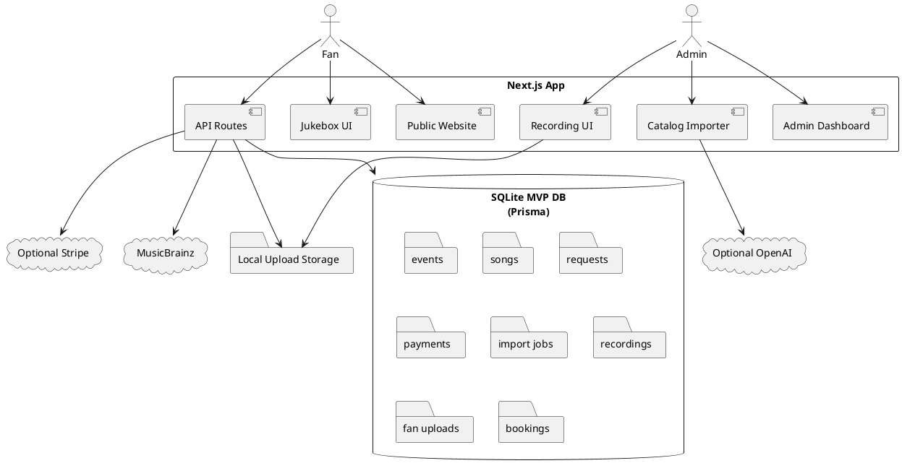
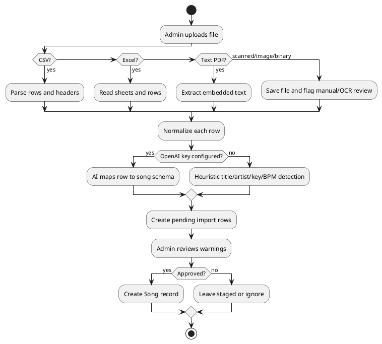
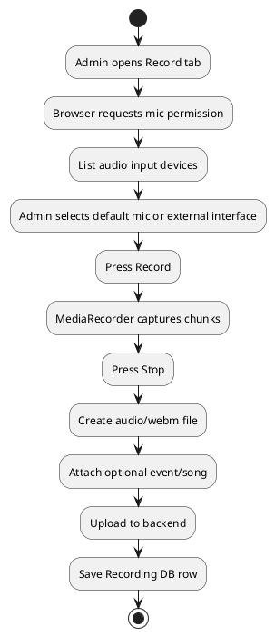

# SPEC-1-GeorgeGrissomLiveFanWebApp

## Background

George Grissom's site is being rebuilt from a static performer website into a real MVP web app. The MVP combines a public music site, audience request/tip flow, private performer dashboard, manual show calendar, song catalog import system, private lyrics/chords/rehearsal notes, fan media uploads, a jukebox concept, and one-button recording.

The uploaded prototype ZIP is preserved under `legacy/` and used as the visual/product seed. This package replaces the static-only prototype with a runnable full-stack app.

## Requirements

### Must Have

- Public website with performer branding, jukebox, calendar, request form, promote flow, uploads, and booking form.
- Real MVP web app with backend APIs and database.
- Admin dashboard protected by login.
- Manual calendar entry in admin.
- Calendar public display as upcoming date list.
- Venue name click/search behavior on public calendar.
- Song catalog import from CSV, Excel, text PDF, text files, and staged scanned/binary files.
- AI-compatible song normalization when OpenAI key is configured.
- Private artist-only lyrics/chords/rehearsal notes.
- Search-and-save workflow so the artist can find song metadata and private learning links.
- Audience song requests with tip amount and priority queue.
- Audience cannot see private live setlist or private song notes.
- Jukebox with two free plays per song before credit/unlock prompt.
- Popup closes on outside click and "maybe later."
- One-button recording from built-in microphone or external mixer/audio interface.
- Fan uploads stored for admin moderation.
- Optional Stripe checkout for tips, catalog unlock, and jukebox credits.
- Demo/manual mode when Stripe is not configured.

### Should Have

- Mobile-friendly public site.
- Tablet-friendly admin dashboard.
- Dark dive-bar jukebox styling and light winery/daytime styling.
- Import staging screen with warnings and approve button.
- Music metadata search via MusicBrainz.
- External web search links for lyrics/chords/key/BPM research.
- Booking inquiry management.

### Could Have Later

- Supabase/Postgres production backend.
- Supabase Realtime, Pusher, Ably, or WebSockets for instant queue updates.
- Cloud object storage.
- Full OCR pipeline for scanned PDFs/images.
- Licensed lyric API integration.
- QR codes per show.
- AI-generated show recaps.
- Public approved media gallery/download page.
- More realistic illustrated scene transitions.

### Won't Have in This MVP

- Native mobile apps.
- Public publishing or sale of private lyrics/chords.
- Automated copyright/licensing decisions.
- Fully automated scanned PDF OCR without additional production service.
- Direct GitHub/Google Drive backup from inside ChatGPT.

## Method

### Architecture

### MVP Technology Choices

- Next.js App Router for web pages and backend route handlers.
- Prisma for database access.
- SQLite for immediate local execution.
- Stripe Checkout as optional payment processor.
- OpenAI structured normalization as optional AI enrichment.
- MusicBrainz API for metadata search.
- Browser `MediaDevices` and `MediaRecorder` APIs for recording.
- Local filesystem uploads for MVP.

### Private Lyrics/Chords Rule

Lyrics, chords, copied reference notes, and rehearsal material are private admin-only records by default. They are stored in:

- `privateLyricsNotes`
- `privateChordNotes`
- `privateRehearsalNotes`

The public site does not render those fields.

### Song Import Algorithm

### Recording Algorithm

## Data Model

The canonical schema is in `prisma/schema.prisma`.

Core entities:

- `Event`
- `Song`
- `Request`
- `Payment`
- `ImportJob`
- `ImportRow`
- `Recording`
- `FanUpload`
- `BookingInquiry`

## Implementation

1. Install dependencies.
2. Configure `.env`.
3. Initialize Prisma database.
4. Seed starter event and songs.
5. Run local dev app.
6. Log into admin.
7. Add real events manually.
8. Add/import real songs.
9. Test public requests and admin queue.
10. Test one-button recording.
11. Configure Stripe for payment testing.
12. Configure OpenAI for smarter imports.

## Milestones

### Milestone 1 — Local MVP Runs

- Site opens.
- Admin login works.
- Database seeded.
- Manual events and songs work.

### Milestone 2 — Live Show Workflow

- Audience submits request.
- Admin sees priority queue.
- Admin marks request accepted/played/skipped.
- Jukebox free-play/credit prompt works.

### Milestone 3 — Catalog Workflow

- CSV/Excel import works.
- Text PDF import works.
- AI normalization works when key configured.
- Admin review/approval works.
- Private notes stay admin-only.

### Milestone 4 — Recording and Media

- Device selection works.
- Built-in mic recording works.
- External mixer/interface input works when browser exposes it.
- Recording saves privately.
- Fan uploads save and can be moderated.

### Milestone 5 — Production Hardening

- Move database to Postgres.
- Move uploads to object storage.
- Replace simple admin password with production auth.
- Add realtime queue updates.
- Configure real Stripe webhooks.
- Add OCR and/or licensed lyrics providers.

## Gathering Results

Evaluate MVP success by checking:

- Can George add events without a developer?
- Can George import messy song lists and approve normalized songs?
- Can private lyrics/chords/notes be stored without public exposure?
- Can a fan request a song and tip?
- Does tip amount change dashboard priority?
- Does the jukebox block after free plays and offer credits?
- Can George record from mic and mixer/interface input?
- Can fan uploads be moderated?
- Can a contractor deploy and extend the app from this package?

## Need Professional Help in Developing Your Architecture?

Please contact me at [sammuti.com](https://sammuti.com) :)
