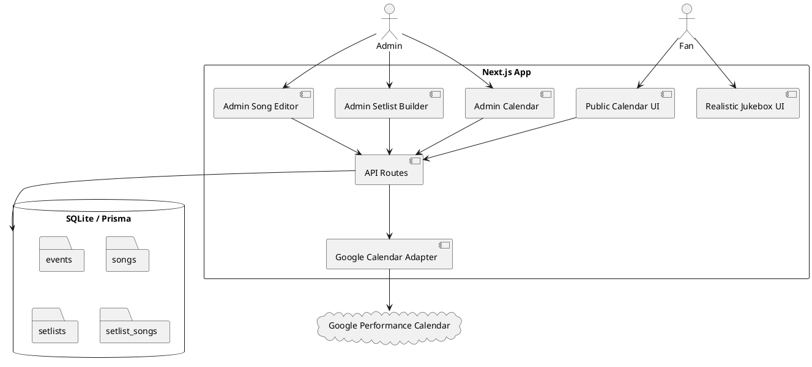
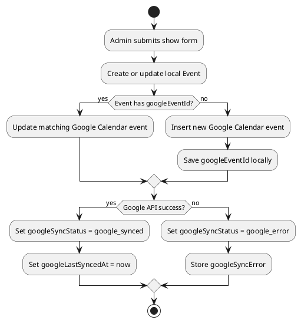
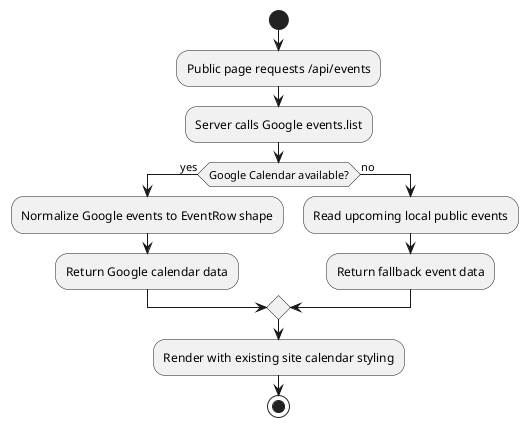
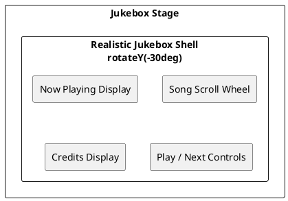

# Chat Transcript — 20260630-1627 — SoftwareArchitectGPT

This is a project-preservation transcript of the visible chat conversation packaged with the final ZIP.

---

## User

_Image uploaded: realistic chrome/glass jukebox reference._

let's have the jukebox look more realistic like this.... Also, there should be a setlist section in admin where i can pick from the list of songs or duplicate an older list, they should be able to be associated with a show on the calendar, a date created maybe, definetely with a venue.  setlists and songs should beable to be freely associated with one another with ease.   adding a song to a setlist should be as easy as checking the box next to it in the song list while searching for songs from the setlist creator, and as easy as typing it in to a field from th song list in the Setlist form field.  

Additionally, the calendar should be able to be interchnageable with google calendar.... meaning i should be able to add a show on the admin page and have it create a new calendar event under "performance calendar" and the public webpage calendar should show any/all events in the PERFORMANCE CALENDAR google calendar.   only the data from the calendar dates, not the look.  HE'ere's the link to the shared public google calendar, The calendar should retain the styling as is currently.   

oops here's the calendar link... https://calendar.google.com/calendar/u/0?cid=MGQ5M2YzYjUxOTFmODBlOTMwY2UwY2RiNzI0OWE3OTYyMzBhZGJkOGJhMjA0OWU3ZTRlMzIzZmZjNjMyY2Y2OEBncm91cC5jYWxlbmRhci5nb29nbGUuY29t

## Assistant

I reviewed the uploaded app ZIP: it is already a **Next.js + Prisma + SQLite MVP**, with existing `Event` and `Song` models, admin calendar, public calendar, and jukebox shell. Here is the proposed **Requirements addendum only** for confirmation.

## Requirements Addendum: Realistic Jukebox, Setlists, Google Calendar Sync

### Must Have

- Replace the current simple illustrated jukebox with a more realistic chrome/glass/LED jukebox treatment based on the uploaded reference image.
- Keep the current site styling and layout behavior; improve the jukebox visual only, not the whole site theme.
- Add an admin **Setlists** section.
- Admin can create a setlist from scratch.
- Admin can duplicate an older setlist.
- Setlists must have:
  - name/title
  - venue
  - optional associated show/calendar event
  - date created
  - notes
- Songs and setlists must have a flexible many-to-many relationship.
- From the setlist creator, admin can search songs and add/remove songs by checking boxes.
- From a song form, admin can type/select a setlist field and associate that song with one or more setlists.
- Setlist song order must be editable.
- Admin-created shows should create/update a Google Calendar event in the shared **Performance Calendar**.
- Public webpage calendar should read event data from the Google Performance Calendar but keep the site’s existing custom visual styling.
- The Google calendar ID from your shared link resolves to:  
  `0d93f3b5191f80e930ce0cdb7249a796230adbd8ba2049e7e4e323ffc632cf68@group.calendar.google.com`
- Store the Google Calendar event ID on the local `Event` record so future edits do not create duplicates.
- Use Google Calendar `events.list` for public event display and `events.insert`/update behavior for admin-created shows.
- Use Google Calendar extended properties or local DB mapping to link app events with Google event IDs for safer sync.

### Should Have

- Admin can filter setlists by venue, date, event, or keyword.
- Admin can view all songs not yet assigned to a selected setlist.
- Setlist creator should support “add all checked,” “remove checked,” and drag/drop ordering.
- Public calendar should fall back to local DB events if Google Calendar is temporarily unavailable.
- Admin should see sync status: `local_only`, `google_synced`, `google_error`.

### Could Have Later

- One-click “create tonight’s setlist from upcoming show.”
- Export setlist to PDF or print view.
- Public optional “tonight’s songs” display after George chooses to publish a setlist.
- Two-way Google Calendar sync for events created directly inside Google Calendar.
- Recurring show support.

### Won’t Have in This MVP

- Changing the embedded Google Calendar visual UI.
- Public access to private setlists unless explicitly enabled later.
- Full conflict-resolution for simultaneous edits in Google Calendar and admin.

Two confirmations before I write the Method section:

1. Should setlists be **admin-only/private** for MVP? My suggested answer: **yes**, keep them private for George first.

2. For Google Calendar write access, can we use a **Google service account** shared onto the Performance Calendar with edit permission? My suggested answer: **yes**, this is cleaner for a server-side Next.js app than requiring George to log in with Google every time.

## User

1:  Yes
1:  Yes

## User

i mean, yes to both.

## Assistant

Great — both confirmed.

## Method Addendum: Setlists, Google Performance Calendar, Realistic Jukebox

### Architecture Update



### Database Changes

Add private admin-only setlists and Google Calendar sync metadata to the existing Prisma schema.

```prisma
model Event {
  id                    String    @id @default(cuid())
  title                 String
  startsAt              DateTime
  endsAt                DateTime?
  venueName             String
  city                  String?
  state                 String?
  notes                 String?
  isPublic              Boolean   @default(true)

  googleCalendarId      String?
  googleEventId         String?   @unique
  googleSyncStatus      String    @default("local_only")
  googleLastSyncedAt    DateTime?
  googleSyncError       String?

  createdAt             DateTime  @default(now())
  updatedAt             DateTime  @updatedAt

  setlists              Setlist[]
  requests              Request[]
  uploads               FanUpload[]
  recordings            Recording[]
}

model Setlist {
  id          String        @id @default(cuid())
  name        String
  venueName   String
  eventId     String?
  notes       String?
  isPrivate   Boolean       @default(true)
  createdAt   DateTime      @default(now())
  updatedAt   DateTime      @updatedAt

  event       Event?        @relation(fields: [eventId], references: [id], onDelete: SetNull)
  songs       SetlistSong[]
}

model SetlistSong {
  id          String   @id @default(cuid())
  setlistId   String
  songId      String
  position    Int      @default(0)
  notes       String?
  createdAt   DateTime @default(now())

  setlist     Setlist  @relation(fields: [setlistId], references: [id], onDelete: Cascade)
  song        Song     @relation(fields: [songId], references: [id], onDelete: Cascade)

  @@unique([setlistId, songId])
  @@index([setlistId, position])
}

model Song {
  id                    String        @id @default(cuid())
  title                 String
  artist                String?
  // existing fields remain unchanged

  setlists              SetlistSong[]
}
```

### Setlist Admin UX

Add a new admin tab: **Setlists**.

Admin workflows:

1. **Create setlist**
   - Name
   - Venue
   - Optional linked calendar show
   - Notes
   - Private by default

2. **Duplicate old setlist**
   - Select old setlist
   - New name defaults to `Copy of <old name>`
   - Copy all associated songs and ordering
   - Allow linking to a different event/venue

3. **Add songs from setlist builder**
   - Search by title, artist, genre, key, mood
   - Results show checkboxes
   - Checking a box adds the song to the setlist
   - Unchecking removes it
   - Drag/drop or up/down buttons update `SetlistSong.position`

4. **Add setlists from song form**
   - In the song editor, include a searchable “Setlists” field
   - Typing a setlist name shows matching private setlists
   - Selecting one creates a `SetlistSong` association

### Google Calendar Integration

Use the shared calendar ID:

```txt
0d93f3b5191f80e930ce0cdb7249a796230adbd8ba2049e7e4e323ffc632cf68@group.calendar.google.com
```

Add server-only calendar adapter:

```txt
src/lib/google-calendar.ts
```

Use `@googleapis/calendar` or `googleapis` on the server side only.

Environment variables:

```env
GOOGLE_CALENDAR_ID="0d93f3b5191f80e930ce0cdb7249a796230adbd8ba2049e7e4e323ffc632cf68@group.calendar.google.com"
GOOGLE_SERVICE_ACCOUNT_EMAIL=""
GOOGLE_SERVICE_ACCOUNT_PRIVATE_KEY=""
```

Calendar behavior:

- Public site calls local API, not Google directly.
- Local API fetches upcoming events from Google Calendar using `events.list`.
- Public UI keeps the current custom website styling.
- Admin-created event saves locally first, then creates a Google Calendar event.
- Local `Event.googleEventId` stores the Google event ID.
- Editing an event updates the matching Google event instead of creating duplicates.
- If Google fails, the event remains local with `googleSyncStatus = "google_error"`.

Use Google extended properties to store the local app event ID:

```ts
extendedProperties: {
  private: {
    georgeAppEventId: event.id
  }
}
```

### Event Sync Algorithm



### Public Calendar Algorithm



### Realistic Jukebox UI

Replace the current simple `.jukebox` CSS illustration with a layered chrome/glass jukebox component inspired by the uploaded reference:

- arched chrome frame
- glowing side tubes
- black glass “Now Playing” display
- digital credits display
- realistic highlights using CSS gradients, shadows, borders, and pseudo-elements
- no external image dependency required for MVP
- preserve existing song click/play logic

Implementation target:

```txt
src/app/site-shell.tsx
src/app/globals.css
```

Create reusable markup:

```tsx
<JukeboxPlayer
  songs={songs}
  currentSong={currentSong}
  creditsRemaining={catalogUnlocked ? "∞" : remainingFreePlays}
  onPlay={playSong}
/>
```

Please confirm this **Method** section, and I’ll move to the **Implementation** steps next.

## User

still turn the jukebox inward 30 degrees.  i think the song list will have to be a scroll wheel?  confirm which method? do what's best for performance  and outcome of what i've asked for.

## Assistant

Confirmed. Best method:

## Method Refinement: 30° Inward Jukebox + Performant Song Scroll Wheel

### Jukebox Orientation

The realistic jukebox should be rendered as a mostly CSS-based component and visually turned inward by **30 degrees**.

Recommended approach:

```css
.jukebox-stage {
  perspective: 1200px;
}

.jukebox-shell {
  transform: rotateY(-30deg);
  transform-style: preserve-3d;
}
```

Use a CSS variable so the angle can be tuned without rewriting the component:

```css
.jukebox-shell {
  --jukebox-angle: -30deg;
  transform: rotateY(var(--jukebox-angle));
}
```

This is better than using WebGL or a heavy 3D renderer because:

- faster to build
- better page performance
- easier to keep responsive on phones
- preserves existing jukebox logic
- matches the realistic chrome/glass goal well enough for MVP

### Song List Display

Yes — the public jukebox song list should become a **scroll wheel-style selector**, not a long flat list.

Recommended behavior:

- center song is the active/selected song
- nearby songs above/below appear slightly smaller/faded
- user can mouse-wheel, drag, swipe, or use keyboard arrows
- clicking/tapping the centered song plays or previews it
- search still exists above the wheel for fast filtering

Important distinction:

- **Public jukebox:** scroll wheel selector for visual effect
- **Admin setlist builder:** searchable checkbox list for speed and accuracy

That gives the best outcome: the public side feels like a jukebox, while admin remains fast and practical.

### Performance Method

Use a lightweight virtualized wheel, not a fully rendered 3D carousel.

Only render about **9 to 15 visible song rows** at a time:

```tsx
<JukeboxSongWheel
  songs={filteredSongs}
  selectedSongId={currentSong?.id}
  onSelect={setCurrentSong}
  onPlay={playSong}
/>
```

Internally:

```txt
all songs
  -> search filter
  -> selected index
  -> visible window around selected index
  -> render only visible rows
```

This keeps it fast even if the song catalog grows.

### Visual Layout



### Final UI Decision

Use this approach:

```txt
CSS realistic jukebox
+ 30° inward rotateY transform
+ lightweight virtualized scroll wheel
+ search filter above wheel
+ existing play/credit logic preserved
```

I recommend locking this in for the Method section.

## User

with your Timestamped, dated, and include your name in the file name for the final zip, but you need to include also the entire chat that we've had here in the docs folder as well. Okay?

## Assistant

Yes — confirmed.

Final ZIP naming format:

```txt
YYYYMMDD-HHMM-SoftwareArchitectGPT-georgegrissomDotCom-webapp-final.zip
```

I’ll also include the visible chat transcript in the project under:

```txt
docs/chat-transcript-YYYYMMDD-HHMM-SoftwareArchitectGPT.md
```

That transcript will include the user/assistant conversation about the jukebox, setlists, Google Calendar integration, and final packaging notes.

## User

Wonderful. Don't stop now. finsh what you've started

## Assistant

Implemented and packaged the final ZIP. The package includes the app source, documentation updates, and this chat transcript.
